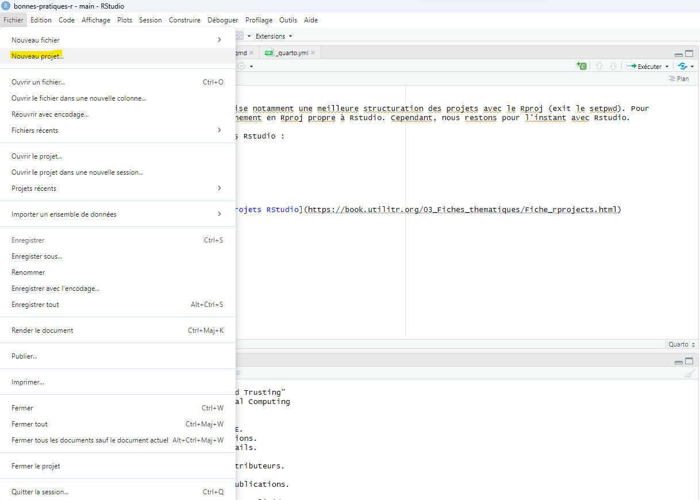
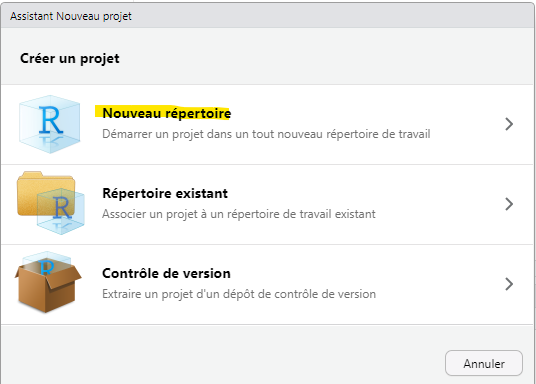
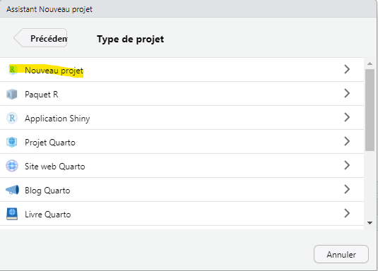
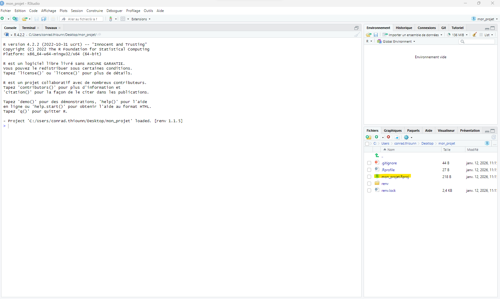
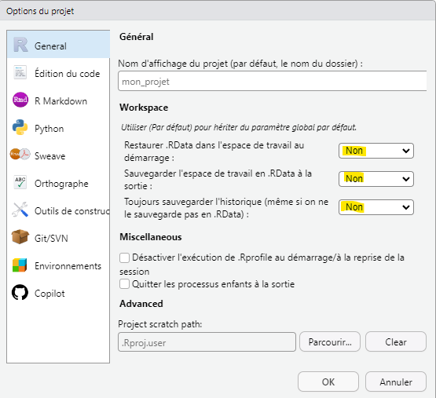
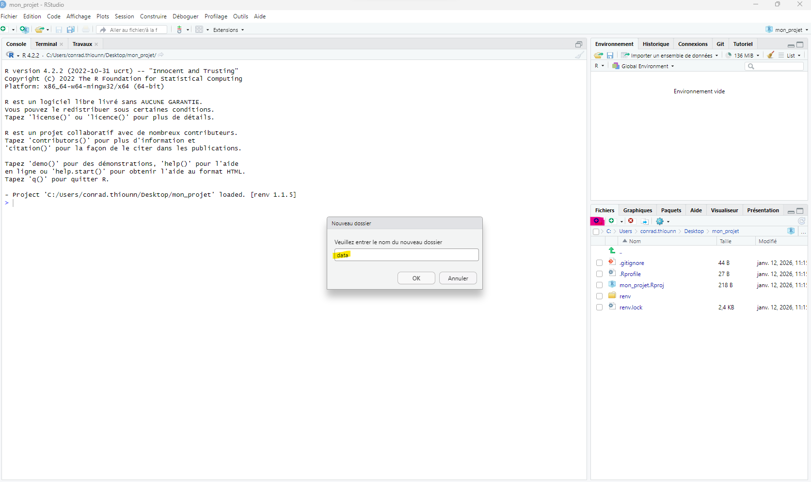
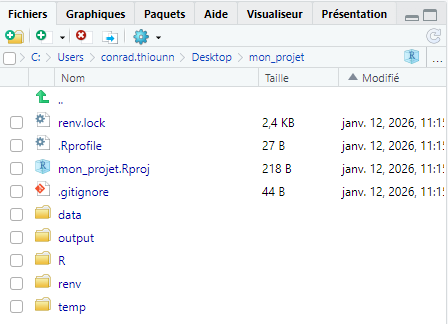
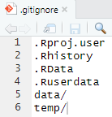

# Démarrer un projet `R` avec `Rstudio`

Rstudio permet de mieux coder en `R` et favorise notamment une meilleure structuration des projets avec le Rproj (exit le setpwd). Pour l'instant, Positron a abandonné le fonctionnement en `Rproj` propre à `Rstudio.` Cependant, nous restons pour l'instant avec Rstudio.

Voici un pas à pas pour créer un projet dans `Rstudio`

## Initialiser un projet

Menu en haut à gauche \> Fichier \> Nouveau Projet

A priori si ex-nihilo, "Nouveau répertoire"

Pour un projet `R` simple, "Nouveau projet"

1.  Renseigner le nom du projet
2.  Activer renv pour la reproductibilité (librairie pour sauvegarder les versions des packages)
3.  Créer un nouveau projet

## Configuration du `Rproj`

On a ensuite la vue suivante, on va configurer le `rproj` (fichier de configuration `Rstudio`):

En bas à droite, cliquer sur le {nom_du_projet}.Rproj

Cela ouvre les options du projet :

1.  Mettre Non à la restauration du `.RData` (pour la reproductibilité on ne charge pas d'état antérieur)
2.  Mettre Non à la sauvegarde du `.RData` (par symétrique on ne sauvegarde pas d'état courant)
3.  Mettre Non à la sauvegarde d'historique (parfois on peut sans faire exprès coller un mot de passe dans la console, peu de personnes réutilisent leur historique également)

## Organiser son projet avec une structure lisible de sous-dossier

Les projets les plus maintenables découpent leur organisation en sous-répertoire, les noms peuvent varier d'une organisation à l'autre, mais les principes restent les mêmes :

1.  Data/Données (où sont stockées les données)
2.  R/Scripts (où sont stockés les programmes)
3.  Output/Résultats (où sont produits les résultats)
4.  Temp/Intermédiaire (où sont stockés les éventuels produits intermédiaires)

Pour cela, créer les sous-répertoires en bas à droite avec l'icone répertoire, puis mettre un nom dans la boite de dialogue :

Cela donne un résultat final comme cela :

Ajuster le fichier `.gitignore` (ici on ignore l'intégralité du répertoire `data` et `temp`, mais ajustez en fonction de vos besoins) :

## Le pourquoi du comment ?

1. Si vous codez en `R`, plutôt que `R`, utilisez `Rstudio` qui est davantage ergonomique. Pour l'instant, on ne passe pas à `Positron` qui demande de s'adapter
2. Si vous codez avec `Rstudio`, il est fortement conseillé de créer un projet `R` dans `Rstudio` et d'utiliser le Rproj et de bien le configurer
3. Pour des raisons de reproductibilité, on ne réutilise pas de session précédente. Le chiffre doit être produit par une chaîne de traitement reproductible, joué du début à la fin. Utiliser une session précédente engendre des risques de ne pas produire le bon chiffre.
4. Vous pouvez faire des sauvegardes intermédiaires pour le développement et l'exploration, mais il est important que la production finale soit joué du début à la fin.
5. Adopter un rangement par sous-répertoire permet de gagner en lisibilité sur le projet. Si ce rangement est similaire à d'autres projets, alors il n'y a pas de coût de passer d'un projet à l'autre.
6. Ne pas sauvegarder les données non publiques, notamment en utilisant `git`. Il faut alors configurer proprement le fichier `.gitignore`.

## Pour en savoir plus

[Documentation Utilit'R : 4 Utiliser les projets RStudio](https://book.utilitr.org/03_Fiches_thematiques/Fiche_rprojects.html)

[Documentation Utilit'R : 32  Structure des projets](https://book.utilitr.org/02_Bonnes_pratiques/02-structure-code.html)

[Newslett'R : Structuration des projets](https://leoniefvr.github.io/Newslett-R/Actus/6_structuration_projet.html)

