# Configurer et utiliser `renv`

`Renv` permet de spécifier quel environnement on utilise et de pouvoir le reproduire.

## Initialiser `renv`

### A la création du projet

A la création du projet dans `Rstudio`, il faut cocher l'option comme indiqué dans le chapitre précédent.

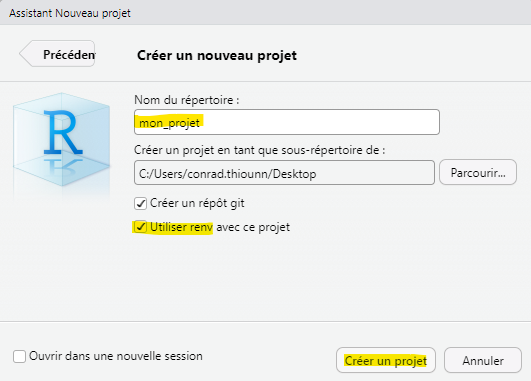

### A posteriori

Il est toujours possible d'installer renv a posteriori. Pour cela, vous pouvez cocher la case dans les préférences du projet en cliquant sur le `.Rproj` \> Environnements \> Utiliser `renv` avec ce projet

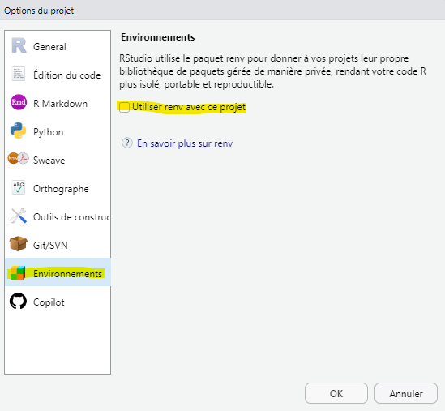

## Tester `renv`

La première ligne de commande (ou fonction) a connaître (comme "git status") permet d'afficher l'état du projet renv :

```{r, eval=FALSE}
renv::status()
```

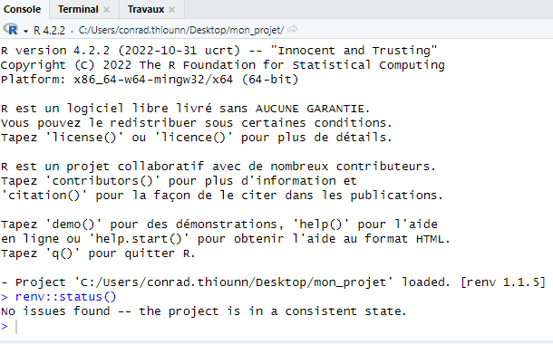

Ici, tout va bien !

On va tester la connectivité de `renv` pour aller télécharger des packages depuis Internet :

```{r, eval=FALSE}
renv::refresh()
```

Cette commande permet de rafraîchir le cache et de récupérer les métadonnées sur Internet

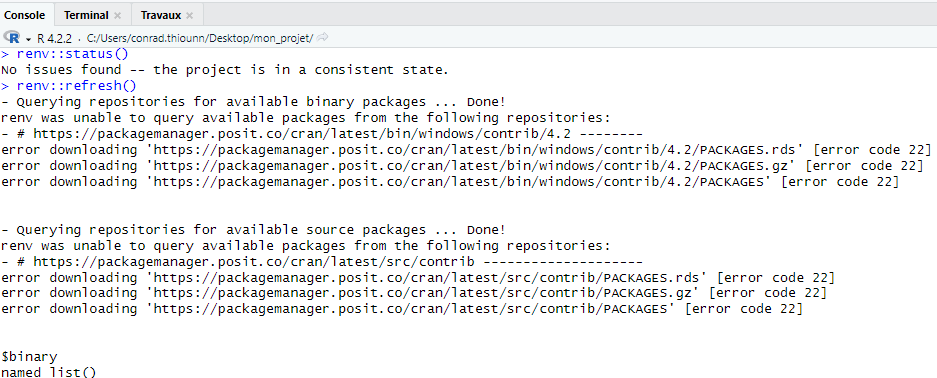

Ici, `renv` n'arrive pas à récupérer les métadonnées sur Internet : on a un problème de proxy d'entreprise.

Après résolution, cela donne :

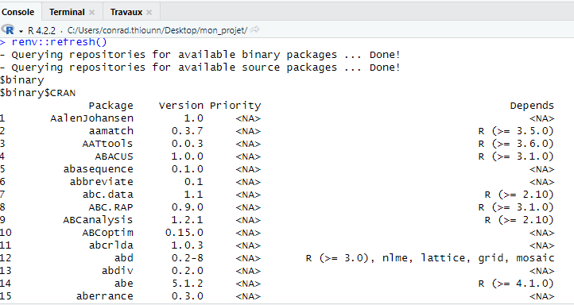

Tout est bon pour commencer à travailler avec `renv` !

## Installer un package avec `renv`

Pour installer un package, il faut passer par la commande install de `renv` :

```{r, eval=FALSE}
renv::install()
```

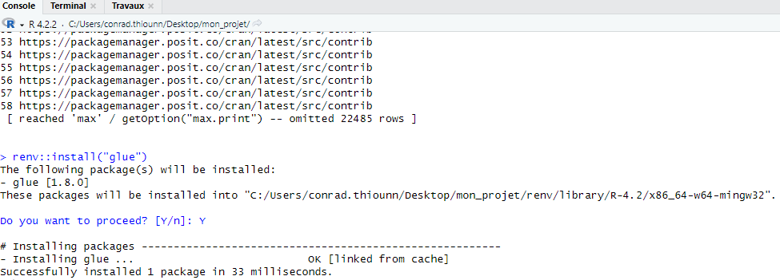

`Renv` réécrit aussi la fonction install.packages si vous avez un environnement `renv` actif. Dans le doute, on vous conseille de toujours installer un package avec renv::install() plutôt qu'install.packages pour être sûr de rester dans l'écosystème de `renv`.

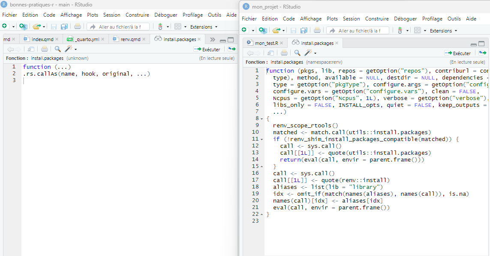

Les packages sont installées dans le sous-répertoire renv/library/ au lieu de l'espace commun de votre poste de travail. Cela permet d'avoir des packages et des versions dédiés au projet sans conflit avec d'autres projets.

## Sauvegarder une configuration

Renv sauvegarde votre configuration dans un fichier principal appelé `renv.lock`.

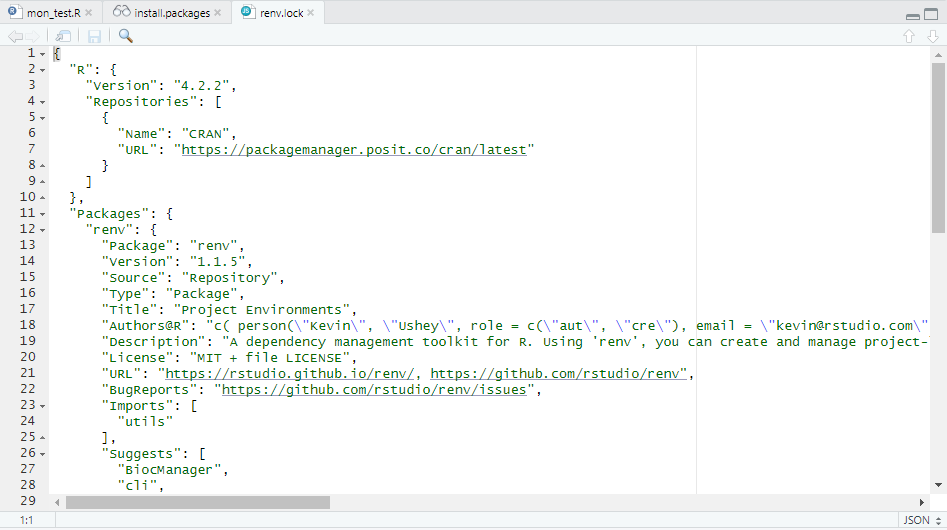

Après installation du package avec renv::install, il faut utiliser le package dans un script (ou sinon cela ne sert à rien d'installer un package non utilisé) et enregistrer la configuration avec la commande renv::snapshot()

```{r, eval=FALSE}
renv::snapshot()
```

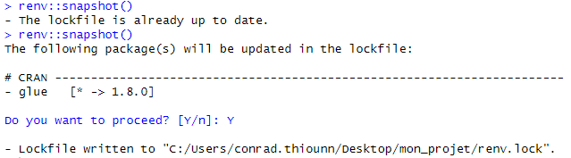

Cela enregistre le package, sa version utilisée et ses dépendances dans le fichier `renv.lock`.

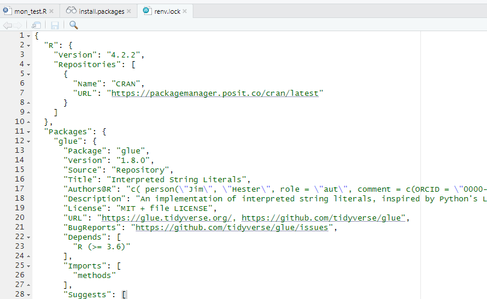

## Restaurer un environnement `renv`

Pour restaurer un environnement `renv`, la commande renv::restore() lit le fichier `renv.lock` et installe les packages spécifiés.

```{r, eval=FALSE}
renv::restore()
```

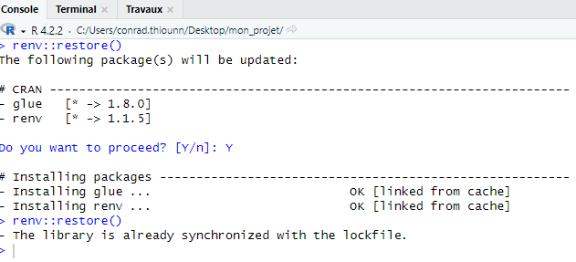

## Résumé

En bref, seulement 4 notions à connaître (état, restore, add, save)

-   Savoir où on est est : renv::status()

-   Restaurer un environnement renv : renv::restore()

-   Installer un package : renv::install()

-   Sauvegarder la configuration : renv::snapshot()

L'environnement de reproductibilité s'ajoute aux codes et ne le détruit pas. Sur des écarts importants de montées de version de `renv`, il est parfois utile de réinitialiser la configuration ex-nihilo, plutôt que de mettre à jour renv. Une reinstallation tabula rasa permet plus souvent de repartir sur une configuration plus propre (et de faire le point sur les packages utilisés)

La configuration `renv` est constitué uniquement du fichier `renv.lock` et du `répertoire renv/` (et une modification du fichier `.Rprofile` pour activer `renv` au démarrage), ainsi qu'un système de cache en dehors du projet, pour pouvoir accelérer une réinstallation. De ce fait, vous pouvez facilement activer ou désactiver renv si besoin.

## Le pourquoi du comment ?

Nous utilisons `renv` pour permettre à quiconque de reproduire les résutalts d'un projet. Cela passe par la sauvegarde des versions des packages utilisés. Une autre manière est de spécifier dans un éventuel fichier `DESCRIPTION` et d'installer avec la commande remotes::install_deps().

Avec quelques commandes, `renv` permet de facilement s'initier avec `git` aux premiers pas de la reproductibilité !

## Pour en savoir plus

[Documentation Utilit'R : 8 Gérer les dépendances](https://book.utilitr.org/03_Fiches_thematiques/Fiche_gerer_dependances.html)

[Newslett'R : Gérer ses environnements R avec `renv`](https://leoniefvr.github.io/Newslett-R/Actus/12_renv.html)

[Package `renv` : présentation et retour d’expérience](https://elisemaigne.pages-forge.inrae.fr/2021_package_renv/presentation.html#1)

[Gestion des packages sur R avec `renv`](https://blog.statoscop.fr/gestion-des-packages-sur-r-avec-renv.html)
